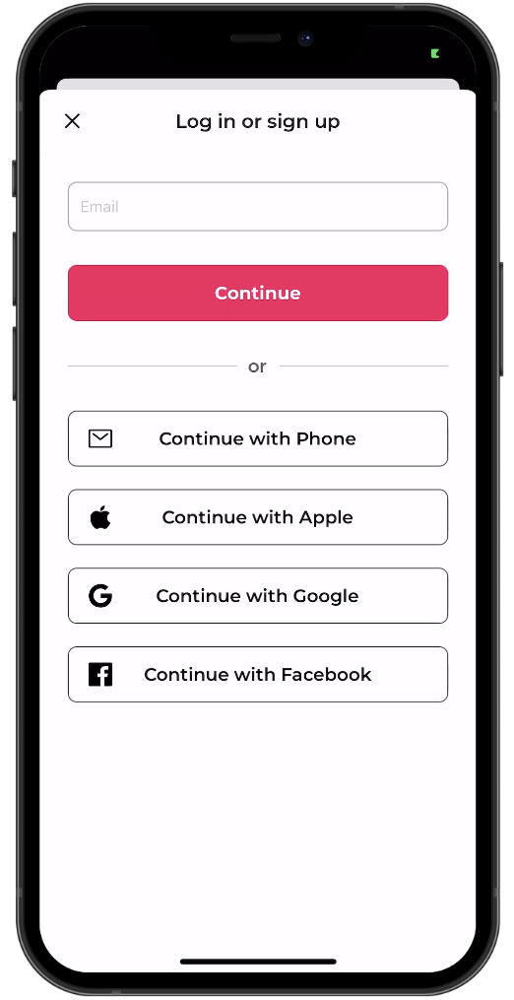

# AirBnB Clone App

This is my first dig at react native, Being a react developer for almost 2 years now this was a logical step. 
Since all my react concepts were fresh making this app was not that hard. Here is a list of all the things I made in this app

1. Made a fully functioning Auth Framework using Clerk as the BE
2. Made Google, Apple and Facebook Signup and Login
3. Implemented FlatLists and animations in different places of the app
4. Added a file based routing system in this, with tabs and modals being routed on their own.
5. Rendered big chunk of data on Simple Views as well as maps
6. The maps were interactive and functional
7. Optimised the data delivery by memoizing essential flows.
8. Created a profile page which has profile picture upload functionality.

### Further Plans on this app

- I'll find free apis for airbnb data and integrate them.
- Create wishlist, Trips and inbox pages.
- Create a chat experience using webSockets.

## Screenshots

## Demo

